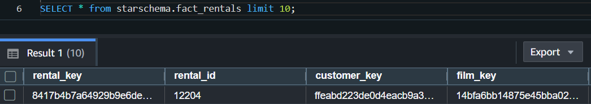

# AWS Data Engineering Batch Platform — Setup & Deployment Guide

## Requirements

- AWS Account with CLI configured
- Python 3.11.15 (Miniconda with pip)
- Terraform v1.14.7
- dbt Core 1.11.7
- dbt-postgres 1.10.0
- dbt-redshift 1.10.1

---

## Step 1 — Configure AWS CLI
```bash
aws configure set region us-west-2
```

> **Note:** Any region change must also be updated in the Terraform variables file.

---

## Step 2 — Deploy Infrastructure with Terraform
```bash
cd terraform
terraform init
terraform validate
terraform plan
terraform apply
```

---

## Step 3 — Load the PostgreSQL Sample Database

### 3.1 Retrieve Database Connection Details
```bash
terraform output
```

Expected output:
```
db_endpoint = "dvdrentals-database.cbia4semc2rv.us-west-2.rds.amazonaws.com:5432"
db_hostname = "dvdrentals"
db_password = <sensitive>
db_port     = 5432
db_username = "postgres_master_user"
```

> **Note:** The password is marked as sensitive. Retrieve it from **AWS Secrets Manager** in the Console.

---

### 3.2 Upload the Backup File to S3

Upload `dvdrental.zip` to the following S3 bucket before connecting:
```
bucket-name: dvd-rentals-database
```

> **Note:** Verify that the **S3 Gateway Endpoint** is associated with the route table of the private subnets used by CloudShell. Without this, CloudShell will not be able to reach the S3 bucket.

---

### 3.3 Connect via AWS CloudShell

Since the RDS instance is on a **private subnet**, direct access from your local machine is not possible. Use **AWS CloudShell** in the Console instead.

Download and extract the backup:
```bash
aws s3 cp s3://dvd-rentals-database/dvdrental.zip .
unzip dvdrental.zip
```

---

### 3.4 Restore the Database
```bash
pg_restore \
  --no-owner \
  --no-privileges \
  --clean \
  --if-exists \
  -d "host=dvdrentals-database.cbia4semc2rv.us-west-2.rds.amazonaws.com \
  port=5432 \
  user=postgres_master_user \
  dbname=dvdrentals \
  sslmode=verify-full \
  sslrootcert=/certs/global-bundle.pem" \
  dvdrental.tar
```

---

### 3.5 Verify the Restore

Connect to the database:
```bash
psql \
  --host=dvdrentals-database.cbia4semc2rv.us-west-2.rds.amazonaws.com \
  --port=5432 \
  --username=postgres_master_user \
  --password \
  --dbname=dvdrentals
```

Confirm the tables were loaded:
```sql
\c dvdrentals
\dt
```

Expected output:
```
                   List of relations
 Schema |     Name      | Type  |        Owner
--------+---------------+-------+----------------------
 public | actor         | table | postgres_master_user
 public | address       | table | postgres_master_user
 public | category      | table | postgres_master_user
 public | city          | table | postgres_master_user
 public | country       | table | postgres_master_user
 public | customer      | table | postgres_master_user
 public | film          | table | postgres_master_user
 public | film_actor    | table | postgres_master_user
 public | film_category | table | postgres_master_user
```

---

## Step 4 — Configure and Run the Glue Ingestion Job

### 4.1 A note on how to Configure the Glue Job

Ensure the Glue job is deployed within the same VPC as the RDS instance. 
The following Spark configuration was added to the job [script](/terraform/jobs/etl_job.py) to enable Glue Data Catalog integration with Iceberg:
```python
spark.conf.set("spark.sql.catalog.glue_catalog", "org.apache.iceberg.spark.SparkCatalog")
spark.conf.set("spark.sql.catalog.glue_catalog.warehouse", "s3://terraform-data-lake-bucket/")
spark.conf.set("spark.sql.catalog.glue_catalog.catalog-impl", "org.apache.iceberg.aws.glue.GlueCatalog")
spark.conf.set("spark.sql.catalog.glue_catalog.io-impl", "org.apache.iceberg.aws.s3.S3FileIO")
```

The data lake bucket is named `terraform-data-lake-bucket` and contains three folders:
```
/landing-layer
/transformation-layer
/serving-layer
```

The Glue job will extract all source tables into `/landing-layer`.

### 4.4 Run the Glue Job

Trigger the job from the AWS Glue console or via CLI:
```bash
aws glue start-job-run --job-name <your-job-name>
```

Monitor the run in the Glue console under **Jobs > Run history**. Proceed to the next step only after confirming a successful run.

---

## Step 5 — Configure Lake Formation Permissions

Terraform sets up baseline Lake Formation permissions, but table- and column-level grants must be configured manually in the Console.

### 5.1 Grant Data Location Access

Go to **AWS Lake Formation > Data permissions > Data Locations** and grant access to the S3 data lake bucket for the following principals:

- Your current IAM user
- `redshift-spectrum-role`

### 5.2 Grant Table and Column Permissions

Go to **AWS Lake Formation > Data permissions** and grant both principals access to the `dvdrentals` catalog database, including all tables and columns.

---

## Step 6 — Run dbt Transformations

With the landing layer populated and Lake Formation permissions in place, run the dbt project to build the star schema on Redshift.

### 6.1 Test the Redshift Connection
```bash
cd dvdrentals
dbt debug
```

### 6.2 Run the Star Schema Models
```bash
dbt run --debug --select starschema
```

Once complete, the following tables will be available in the **Redshift Query Editor v2**:

